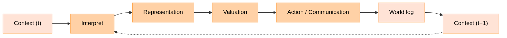

# Ascribe

A deterministic multi‑agent framework for making psychological value assumptions explicit, testable, and reproducible.

Ascribe exists to turn beliefs about context, identity, and affect into auditable models&mdash;so we can study how those beliefs shape behavior in shared worlds and use the results to design safer systems and human studies. When you run Ascribe, agents don’t just “choose.” They perceive context, interpret what they see, update a structured internal representation, read out bounded values, and then act or communicate. Because the world advances in deterministic steps, runs are comparable and replayable. You can change one assumption at a time and see exactly what changes.

Imagine two cohorts viewing the same objects under different visibility rules. Public endorsements ripple widely; whispers stay within a group; a few private exchanges rewire identity ties. With Ascribe, you encode those rules, observe whether values converge, drift, or polarize, and quantify when coalitions form&mdash;all with artifacts you can inspect and re‑run.

## The CRV/CIRVA loop

Ascribe names the modeling loop CRV/CIRVA: Context → (Interpret) → Representation → Valuation → (Action). Each phase is explicit, and the timing is barriered: what’s computed at time t applies at time t+1, which makes runs deterministic and suitable for careful comparison.



**Context** arrives through channels with scoped visibility&mdash;public, group, room, or direct&mdash;and optional delays. **Interpretation** turns observations into typed, inspectable appraisals. **Representation** updates a structured internal graph of identity and affect (for example, self→object “endowment,” self→other ties, perceived other→object stances, and object→valence traces). **Valuation** reads bounded values from that representation to score options. **Action** and communication follow&mdash;acquire, relinquish, relate, endorse, exchange, or speak&mdash;with the world logging outcomes.

## From question to evidence

Work in Ascribe starts with a hypothesis you can articulate and test. Suppose endorsements are public but exchanges are private: do visible approvals amplify attachment more than quiet trades? You set the rules of the world, choose personas, and run the same CRV/CIRVA loop. Because both state and timing are explicit, you can replay runs exactly, vary one ingredient at a time, and attribute differences to the change you made.

When you need speed, you can elicit offline valuation policies for a persona without external services. Those policies plug into the same loop, letting you sweep scenarios quickly before committing to heavier experiments.

## Try it quickly

Run a small simulation and open the app:

```bash
uv run crv-abm-sim --n 30 --k 1 --steps 100 --seed 123 --out out/run
uv run crv-app --run out/run
```

Build a mock offline policy (no external keys), then use it in a sim:

```bash
uv run crv-lab build-policy --runs-root runs/policy_demo --mode mock --persona persona_baseline --model gpt-4o
RUN_DIR=$(ls -dt runs/policy_demo/* | head -1)
uv run crv-abm-sim --policy "$RUN_DIR/policies/policy_crv_one_agent_valuation_v0.1.0.parquet" --steps 50 --out out/policy_sim
uv run crv-app --run out/policy_sim
```

## What’s included today

- A world kernel that executes the CRV/CIRVA loop and writes deterministic artifacts.
- Typed interfaces for cognition so interpretations, state patches, and decisions remain explicit and auditable.
- A “lab” path to elicit per‑persona valuation policies over scenarios for fast sweeps without external services.
- A read‑only app for exploring runs and seeing how identity and values evolve.

Boundaries between parts are clear so you can extend cognition or visibility rules without breaking determinism.

## Artifacts at a glance

- Each run produces Arrow‑friendly tables you can analyze or revisit.
- You’ll see `agents_tokens.parquet` (time‑stamped per‑agent, per‑object signals such as $s_{io}$, `value_score`, `holdings`), `model.parquet` with `metadata.json` (the configuration snapshot), and `events.parquet` (observations and actions with channel/scope/delay).
- Relation tables include `relations.parquet` ($i\to j$), `other_object.parquet` ($i\to j$ on $o$), and `object_object.parquet` ($o\to o$). Lab runs add `policies/policy_*.parquet` and a tidy summary.
- Files are append‑only and replayable for careful comparison.

## Learn more

- Start with the quick guide: [Getting Started](guide/getting-started.md).
- Explore the app and charts, then open the tables in your analysis tool.
- When you’re ready to dig deeper, see the API docs for World, Lab, Mind, IO, and Core under `/api/crv/`, and the conceptual notes in concept_docs/ for the broader research trajectory.

---

Note: This documentation is a preview; guidance and APIs are evolving.
